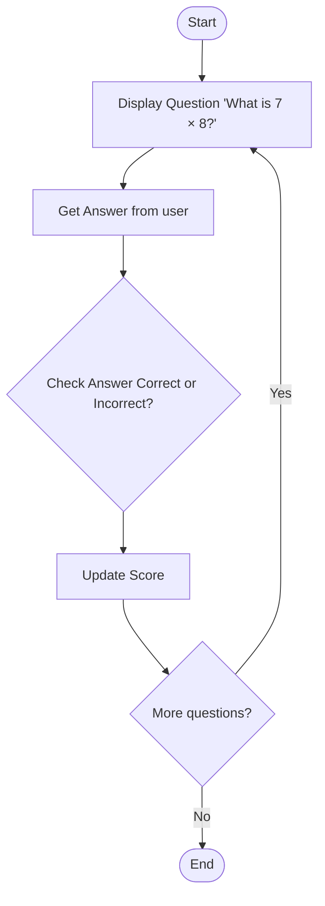

```mermaid
flowchart TD
    A([Start]) --> B[Display Question 'What is 7 × 8?']
    B --> C[ Get Answer from user ]
    C --> D{Check Answer Correct or Incorrect?}
    D --> E[Update Score]
    E --> F{More questions?}
    F -- Yes --> B
    F -- No -->  G([End])
```
