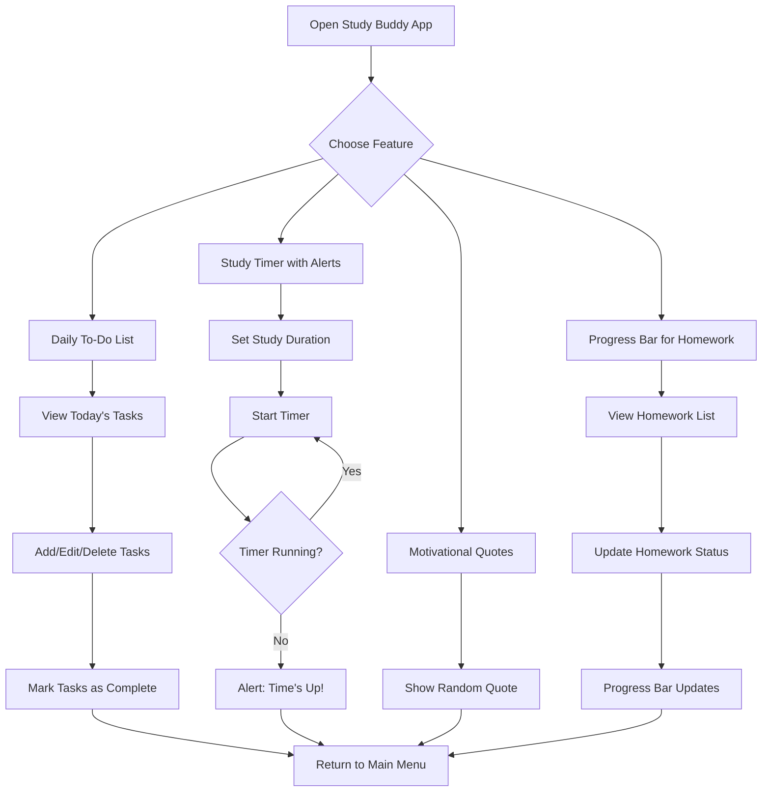

```mermaid
flowchart TD
    A[Open Study Buddy App] --> B{Choose Feature}
    B --> C[Daily To-Do List]
    B --> D[Study Timer with Alerts]
    B --> E[Motivational Quotes]
    B --> F[Progress Bar for Homework]

    %% Daily To-Do List Flow
    C --> C1[View Today's Tasks]
    C1 --> C2[Add/Edit/Delete Tasks]
    C2 --> C3[Mark Tasks as Complete]
    C3 --> G[Return to Main Menu]

    %% Study Timer Flow
    D --> D1[Set Study Duration]
    D1 --> D2[Start Timer]
    D2 --> D3{Timer Running?}
    D3 -- Yes --> D2
    D3 -- No --> D4[Alert: Time's Up!]
    D4 --> G

    %% Motivational Quotes Flow
    E --> E1[Show Random Quote]
    E1 --> G

    %% Progress Bar for Homework Flow
    F --> F1[View Homework List]
    F1 --> F2[Update Homework Status]
    F2 --> F3[Progress Bar Updates]
    F3 --> G

    G[Return to Main Menu]
```
